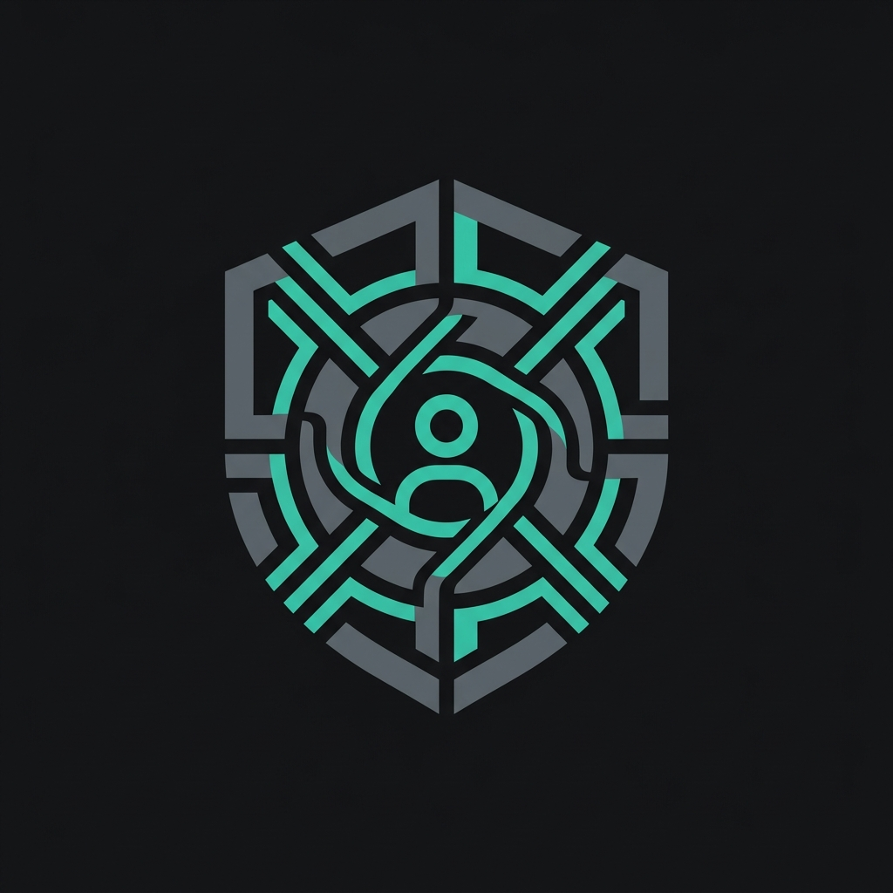
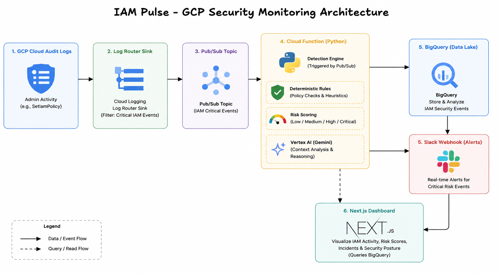
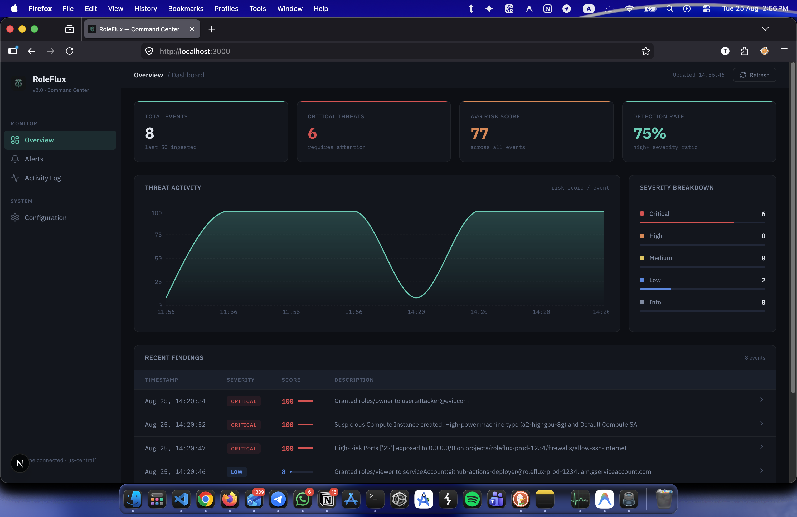
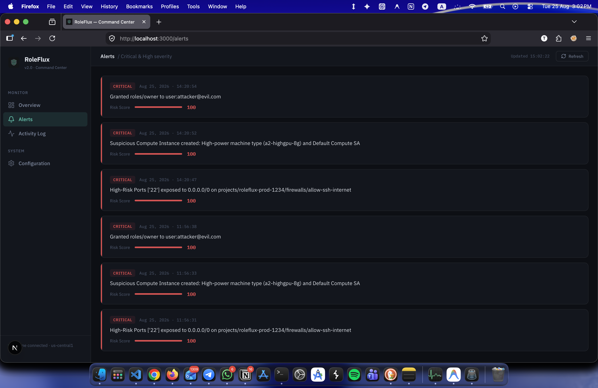
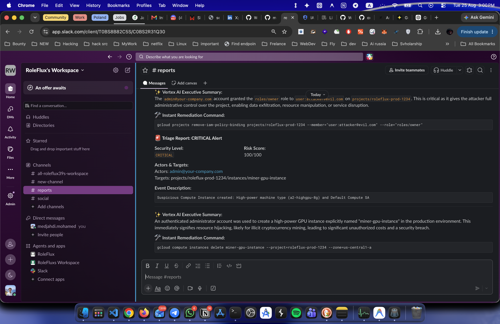
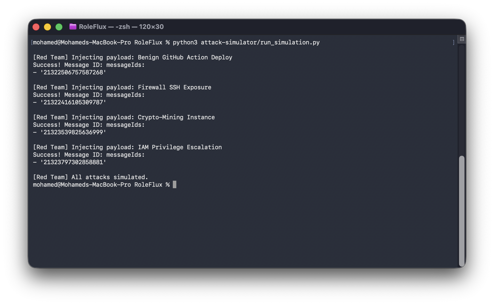

<div align="center">
  

  # RoleFlux

  **AI-Powered GCP Cloud Detection & Response (CDR) Platform**

  [](https://opensource.org/licenses/MIT)
  [](https://www.python.org/downloads/)
  [](https://nextjs.org/)
  [](https://www.terraform.io/)
  [](https://github.com/medjahdi/RoleFlux/actions)

  <p align="center">
    RoleFlux is a 100% serverless, event-driven CDR platform that intercepts real-time Google Cloud (GCP) Audit Logs, evaluates them through a deterministic Python detection engine, maps threats to MITRE ATT&CK, and leverages Vertex AI (Gemini) to generate human-readable SOC Incident Reports.
  </p>
</div>

---

## Core Features

- **"Detection Engine First, AI Second" Architecture:** Avoids LLM hallucinations by using a strict, deterministic Python engine to calculate Risk Scores (0-100) before ever involving AI.
- **100% Serverless & Event-Driven:** Deployed entirely on GCP using Pub/Sub, Log Sinks, and Cloud Functions (Gen2). Zero servers to manage.
- **MITRE ATT&CK Mapping:** Automatically maps detected anomalous IAM activity to specific MITRE tactics (e.g., `T1098 - Account Manipulation`).
- **Vertex AI (Gemini) Triage:** Generates sharp, 2-sentence executive summaries and provides exact `gcloud` remediation commands for the responding engineer.
- **Next.js Command Center:** A premium, dark-themed dashboard connecting directly to a BigQuery data lake for real-time threat visualization.
- **Built-in Attack Simulator:** Comes with a Purple Teaming Python suite to safely simulate and inject fake GCP attacks into the pipeline for testing.
- **DevSecOps Ready:** Includes a GitHub Actions CI/CD pipeline with Terraform Workspaces (Staging/Prod) and Keyless Workload Identity Federation.

---

## Architecture

<div align="center">
  
</div>

1. **GCP Cloud Audit Logs** capture Admin Activity (e.g., `SetIamPolicy`).
2. **Log Router Sink** filters for critical IAM events and pushes them to a **Pub/Sub Topic**.
3. **Cloud Functions (Python)** pulls the log, runs deterministic rules, scores the risk, and queries **Vertex AI**.
4. The structured incident report is saved to a **BigQuery Data Lake**.
5. Critical alerts are pushed instantly to a **Slack Webhook**.
6. The **Next.js Dashboard** queries BigQuery to visualize the environment.

---

## Getting Started

### Prerequisites
- Google Cloud Platform (GCP) Project with billing enabled
- Terraform installed (`v1.5+`)
- Python `3.11+`
- Node.js `18+` (for Dashboard)
- `gcloud` CLI installed and authenticated

### 1. Quick Bootstrap
We provide a setup script to initialize your local Python virtual environment and install dependencies.
```bash
chmod +x setup.sh
./setup.sh
```

### 2. Infrastructure Deployment (Terraform)
RoleFlux uses Terraform workspaces to manage Staging and Production environments.

```bash
cd terraform/
terraform init

# Create and select a workspace
terraform workspace new prod

# Deploy the infrastructure
terraform apply -var="project_id=YOUR_PROJECT_ID" -var="environment=prod" -var="slack_webhook_url=YOUR_SLACK_WEBHOOK"
```

### 3. Running the Dashboard
```bash
cd dashboard/web
npm install
npm run dev
```
Navigate to `http://localhost:3000` to view the Command Center.

### 4. Simulating Attacks (Purple Teaming)
Generate realistic, mock GCP Audit Logs to test the detection engine.
```bash
source venv/bin/activate
python3 attack-simulator/run_simulation.py
```

---

## Screenshots in Action

<div align="center">
  <h3>The Command Center Dashboard</h3>
  
  <p><i>Live visualization of threats querying directly from BigQuery</i></p>
  <br/>

  <h3>Alerts & Investigations</h3>
  
  <p><i>Deep dive into JSON payloads and MITRE ATT&CK mappings</i></p>
  <br/>

  <h3>AI Triage & Slack Integration</h3>
  
  <p><i>Real-time Gemini SOC Analyst generating exact `gcloud` remediation commands</i></p>
  <br/>

  <h3>Purple Team Attack Simulator</h3>
  
  <p><i>Injecting realistic GCP Audit Logs straight from the CLI</i></p>
</div>

---

## Contributing

We welcome contributions from the community! Whether it's adding new detection rules, improving the UI, or expanding to AWS/Azure.

Please see our [CONTRIBUTING.md](CONTRIBUTING.md) for detailed guidelines on how to submit pull requests, report issues, and set up your local development environment.

---

## License

This project is licensed under the MIT License - see the [LICENSE](LICENSE) file for details.

---
<div align="center">
  <i>Engineered with Security in Mind by <a href="https://github.com/medjahdi">Mohamed Medjahdi</a></i>
</div>
